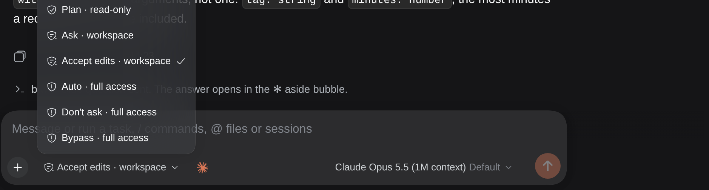
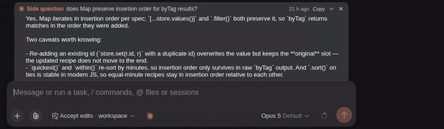
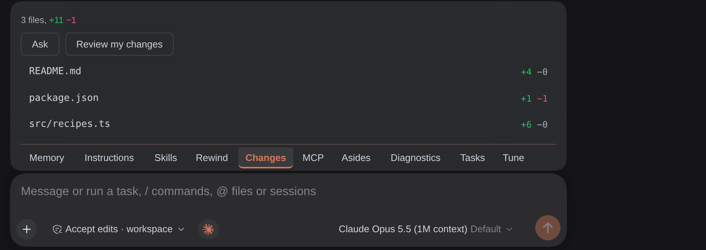
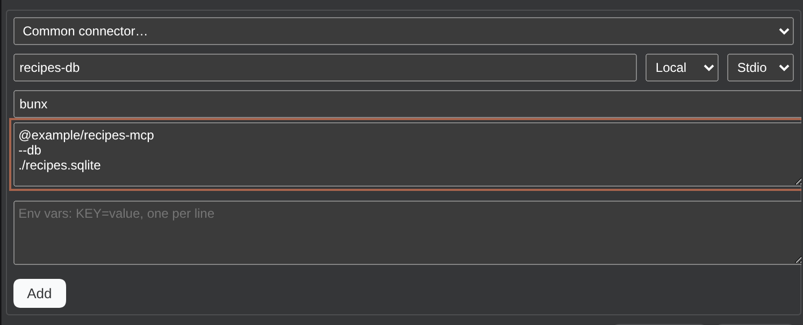
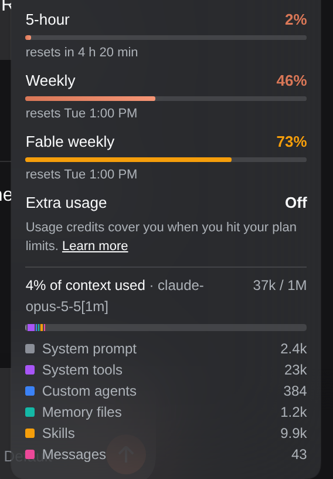
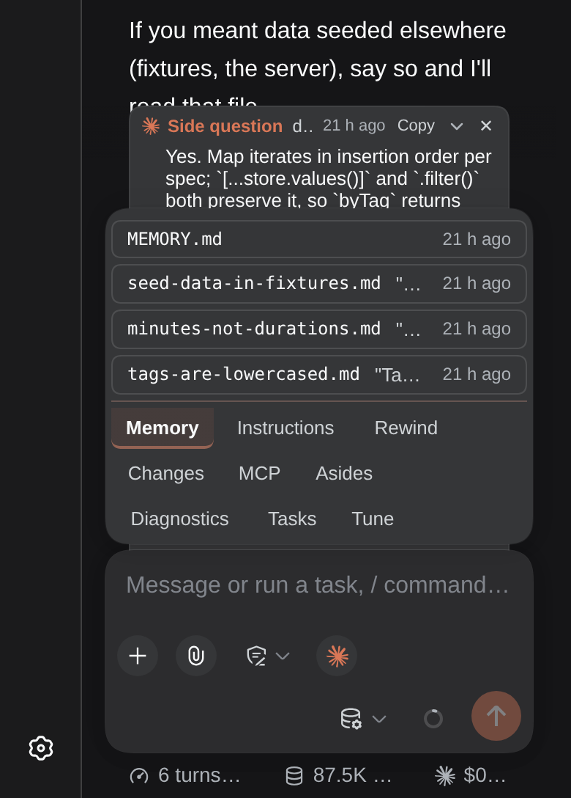
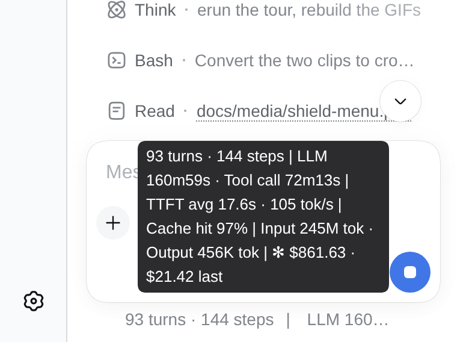

<h1 align="center">✻ Oh My Claude</h1>

<p align="center">
  <strong>Claude Code, native inside dsh</strong>
</p>

<p align="center">
  <em>Drive your logged-in Claude Code CLI as a first-class dsh provider: no API key, no extra services, no runtime dependencies.</em>
</p>

<p align="center">
  
  
  
  
  
</p>

<p align="center">
  <sub>Built with AI assistance, and open to more. Contributions from AI coding agents are welcome; start with <a href="CLAUDE.md">CLAUDE.md</a> and the ranked <a href="docs/queue.md">docs/queue.md</a>.</sub>
</p>

---

Claude Code CLI as an LLM provider for [dsh](https://github.com/deepseek-ai/dsh). Every request drives `claude -p` with stream-json in and out, so it uses whatever login, hooks, CLAUDE.md files, MCP servers and rate limits Claude Code already has. No API key needed. The plugin speaks the CLI's own protocol (the one the Agent SDK wraps) directly, so it has no runtime dependencies.

## Tour

<p></p>

The shield is dsh's own control; in a Claude session its rows become Claude's six permission modes, each labelled with the dsh access level it sets underneath.

<p></p>

One `✻` button beside the composer opens a panel with Restore, Memory, Rewind, Changes, MCP and Tune tabs.

<p> </p>

<p></p>

Cost and cached token count, figures dsh cannot compute, join dsh's footer stats row and its phone bubble.

<p>  </p>

Plan usage and the CLI's own context breakdown live in dsh's context ring popover; on a phone the panel becomes a sheet and the cost rides the stats bubble. Captured by `tools/playwright/tour.mjs`.

## Install

Needs the Claude Code CLI on `PATH` and already logged in (`claude --version` works, `claude` opens without asking you to sign in). Nothing else: no API key, no Node build step.

```sh
dsh plugin --profile web add github:lcestou/oh-my-claude
systemctl --user restart dsh-web.service   # or restart `dsh web` however you run it
```

The package declares a dsh bundle, so `dsh plugin add` registers it in the profile by itself. After the restart, "Oh My Claude" appears in the model picker with the models your login can use. Pick one and chat.

Optional, in `~/.dsh/settings.yaml`:

```yaml
agent-default-model:            # make Claude Code the default for new sessions
  provider: claude-code
  model: claude-fable-5-1
subagent-model-selection:       # let dsh subagents run on Claude Code too
  enabled: true
  allowedModels:
    - provider: claude-code
      model: claude-haiku-4-5
```

Plugin settings live under Settings → Claude Code, or as `config:` on the bundle row if you override it in the profile's `cordis.patch.yml`.

### Developing

Install from a checkout instead: `dsh plugin --profile web add link:/path/to/dsh-oh-my-claude-code`. The source is strict TypeScript under `src/`; dsh loads the compiled output in `lib/`, so run `bun run build` after every edit and restart (the patch layer hot-reloads, plugin code does not). `lib/server` comes from `tsc`, `lib/client.js` from `bun build` of `src/client/index.tsx`; both are committed, so a plain install has them. `bun run check` runs lint (oxlint with the anti-slop rules in `tools/oxlint`), format check, typecheck, tests and the build.

Lint contract, read before writing code (the anti-slop rules in `.oxlintrc.json` fail the build and cost a worker 25 check runs on 2026-09-05):

- Every `as` assertion needs a `// SAFETY: <the invariant that makes it true>` comment on the line directly above it. Prefer a type guard or a narrower type so no assertion is needed. No `as X as Y` chains, no `as unknown as`.
- No `typeof x === "string"` style runtime checks in `src/adapter.ts` and `src/client/index.tsx` (test files and the listed server modules are exempt). Use the existing narrowing helpers (`isJsonObject`, `textOf`, schema parsing) or a typed field.
- No conditional empty-object spread (`...(cond ? { a } : {})`). Assign the property in a separate statement when present.
- No `unknown` parameters, returns or type aliases in `src/adapter.ts`; name the shape.
- Do not widen a known literal (`const x: string = "bash"`); let inference keep the literal.
- No `_prefixed` identifiers (`no-underscore-dangle`), no shadowed names (`no-shadow`), no unused variables.
- Run `bun run check` after each edit, not once at the end: the first run tells you which rule you are fighting, and `oxfmt src/` fixes formatting in place.

Client bundle safety: dsh hot-reloads `lib/client.js` the moment `bun run build` writes it, into every open tab. A wrong service name in `export const inject` leaves the plugin `pending (waiting for service: …)` and every panel it owns disappears (2026-09-05: `models` instead of `modelDirectories`). After any client build, run the headless check and read its first line:

```sh
TOKEN=$(grep -o 'token=[A-Za-z0-9_-]*' ~/.local/state/dsh/web.log | tail -1 | cut -d= -f2)
PLAYWRIGHT_ROOT=/path/to/a/project/with/playwright node tools/playwright/peek.mjs "$TOKEN"
```

It prints the sidebar text (a `Failed to load plugins` line means roll back with `git show main:lib/client.js > lib/client.js` and rebuild). `tools/playwright/turn-status.mjs <token> <out.png>` and `restore-button.mjs <token> <out.png>` screenshot the two DOM features. These are development checks only; nothing in the plugin needs Playwright.

## Configuration

All keys are optional.

| Key | Default | Meaning |
|---|---|---|
| `command` | `claude` | Claude Code binary: a name on PATH or an absolute path. |
| `spawn` | `keeper` | How the process starts. `keeper`: under a small keeper process outside dsh's process tree (its own systemd user scope when `systemd-run` exists, else a detached process), so a dsh restart leaves Claude running and the new dsh reattaches; see Restarts. `node`: directly, as dsh's child. `dsh`: through dsh's subprocess seam (`ctx.subprocess`). With a remote provider such as [a remote subprocess provider](https://example.com/remote-provider) mounted, a remote workspace then runs Claude Code on that machine; the seam scrubs credential-shaped env vars (KEY/TOKEN/SECRET/PASSWORD), so log in on the machine that runs it. |
| `sshHost` | `` | Drive this instance's Claude Code on a remote host over SSH (`[user@]host`, or a `Host` alias from `~/.ssh/config`). This box's harness runs `claude` there, nothing else runs on the far side, and the stream flows through the ssh pipe. Uses the remote's own `~/.claude` login, so the status, diagnostics, Settings and Tune panels report and edit that box; forces node-style spawn (no keeper survival yet). The dsh MCP bridge and the remaining file-reading tabs (Browser, Memory, Instructions, Rewind) do not reach the remote yet, so keep `dshTools` off. Key-based auth only (`BatchMode`); a missing key fails fast rather than prompting. See "A box over SSH". |
| `permissionMode` | `dsh` | Claude Code permission mode for the tools it runs itself. `dsh` follows the session's access-mode switch in the dsh UI: read-only → `plan`, workspace-write → `acceptEdits`, danger-full-access → `bypassPermissions`. Any explicit value pins it. |
| `allowedTools` | `[]` | Extra `--allowedTools` entries. |
| `disallowedTools` | `[]` | `--disallowedTools` entries. |
| `addDirs` | `[]` | Extra `--add-dir` directories. |
| `pluginDirs` | `[]` | Local plugin directories (or `.zip` files) loaded for this session only, as repeatable `--plugin-dir`. Session-scoped, so they write no settings and do not show in the roster; a CLI without the flag leaves them off, and a path the CLI's policy refuses surfaces its own refusal. |
| `pluginUrls` | `[]` | Plugin `.zip` URLs fetched for this session only, as repeatable `--plugin-url`. Same session scope as `pluginDirs`. |
| `maxTurns` | unset | `--max-turns` cap per request. |
| `maxBudgetUsd` | unset | `--max-budget-usd` cap per request. |
| `titleModel` | `haiku` | Model used for dsh's session-title requests. |
| `toolActivity` | `true` | Show Claude Code tool calls and results as native tool rows. |
| `resume` | `true` | Keep one Claude Code session per dsh session. |
| `idleTimeoutMs` | `1800000` | Kill the child when no stream event arrives for this long; surfaces as `IDLE_TIMEOUT`. |
| `toolTextLimit` | `600` | Characters of a tool result kept in its session row. |
| `debug` | `false` | Log the spawn arguments (prompt redacted) and cwd per call. |
| `approvals` | `true` | Relay Claude Code permission prompts and AskUserQuestion to dsh dialogs. |
| `processIdleMs` | `1800000` | Kill a session's idle Claude process after this long without a turn. |
| `maxProcesses` | `4` | Cap on live Claude processes; the longest idle is evicted first. |
| `fastMode` | `false` | Launch every Claude process with fast mode on (`--settings '{"fastMode":true}'`, Opus only, higher cost). The bridged `/fast` then toggles it for that session; in headless mode the toggle only works when the session started this way. |
| `commandBridge` | `true` | Register Claude Code's slash commands (skills, custom commands, from the CLI's init frame) as dsh `/commands` that hand the line to Claude. dsh's own command of the same name wins. |
| `redactSecrets` | `true` | Mask values of env vars named `*KEY`, `*TOKEN`, `*SECRET`, `*PASSWORD` or `*CREDENTIAL` (8+ chars) in Claude's tool results as `[redacted:NAME]` before dsh sees them. |
| `persistTodos` | `true` | Re-append the last todo list at each turn start so dsh's panel keeps it. |
| `continueAfterLimit` | `true` | When a usage limit ends a turn, wait for the reset and continue the task on its own, as the CLI does. |
| `configDir` | `` | Claude Code config dir for this plugin instance (exported as `CLAUDE_CONFIG_DIR` to every spawned CLI process); empty = the env var or `~/.claude`. Moves transcripts, `settings.json` and `.credentials.json` together, groundwork for multi-account mounts. |
| `providerId` | `claude-code` | Provider id in the model picker. The default is `claude-code`; anything starting with `claude-code-` (e.g. `claude-code-work`) mounts a second independent instance with its own login, state and process registry. |
| `providerName` | `` | Display name in the model picker. Empty = "Oh My Claude" for the default id, else "Oh My Claude (\<suffix\>)" where suffix is the part after `claude-code-`. |
| `dshTools` | `true` | Serve dsh tools (subagents, jobs, goals, skills, web search) to Claude Code over MCP. |

Effort: none is advertised as default, so Claude Code's own default applies unless you pick one in dsh. Claude Code's own subagents stream back as `↳ subagent` reasoning blocks. Tool calls the CLI denies because it cannot prompt are counted and reported in one line at the end of the turn.

## How it works

**Models.** The picker is filled from the Anthropic Models API, using `ANTHROPIC_API_KEY` if set, otherwise the access token Claude Code stores in `~/.claude/.credentials.json`. Cached ten minutes; the hardcoded list in `src/adapter.ts` is the fallback. Context window and effort levels come from the same response, and picking an effort in dsh maps to `--effort`. `settings.json` then gets the say the terminal gives it, read fresh on each listing: `modelPicker.options` adds its rows (dropping the built-in lineup when `replaceBuiltInOptions` is set) and `availableModels` allows only the families, versions or ids it names, with the Default row surviving either way. Only the listing is filtered: a session already on a model the allowlist excludes keeps resolving it, as the terminal does. The API dates some ids (`claude-haiku-4-5-20251001`) and leaves others alone, while the fallback list and the CLI's picker use the undated form; since dsh keys a model by its id, an API id whose undated form is one the fallback list names is advertised undated. Otherwise every switch between the API and the fallback retired the model you had enabled and offered an unselected copy of it. An id the fallback list does not name keeps whatever the API called it.

**Sessions.** Each dsh session gets a deterministic Claude Code session id. The first request starts it with `--session-id`; later requests find the transcript under `~/.claude/projects/<cwd>/` and pass `--resume`, sending only the new turn. Reopening an old dsh session resumes the same Claude Code session, with all its tool history. Forked sessions start fresh from the full dsh transcript. The child runs in the dsh session's working directory, so Claude Code sees the right CLAUDE.md and project files.

**Temporary sessions.** Type `/temporary` in a session to toggle it: from the next turn its Claude process runs with `--no-session-persistence`, so nothing lands under `projects/` for it, and the session is never resumed on the Claude side; a dsh restart continues it from dsh's own log instead. Type `/temporary` again to switch back. The mark lives in memory (it survives a plugin reload, not a dsh restart).

**Process.** One `claude` process stays alive per dsh session (`processIdleMs`, default 30 min; `maxProcesses`, default 4, evicts the longest idle). Turns after the first start in about a second because hooks, CLAUDE.md and MCP servers are already loaded. A change of model, effort, working directory or permission mode replaces the process; the Claude session is resumed, so nothing is lost.

**Approvals and questions.** With `approvals: true` (default) the child runs with `--permission-prompt-tool stdio`. When Claude Code would ask permission, dsh's own approval dialog appears; Approve runs the tool, Deny tells Claude the user refused. Claude's `AskUserQuestion` becomes a dsh question form and the answer goes back to Claude. Under Full Access nothing asks, except plan review: when Claude leaves plan mode (`ExitPlanMode` arrives as a permission request carrying the plan), dsh's own Plan review panel shows it with Approve and Keep planning; approval lets the tool run, anything else goes back to Claude as "the user chose to keep planning" with the typed feedback. Each ask also shows as a `⚑ approval: Tool …` or `❓ question …` row.

**Secrets.** Values of environment variables whose name looks like a secret are masked in Claude's tool results before they reach the session log (`redactSecrets`), since the CLI inherits dsh's environment and a `cat .env` would otherwise persist verbatim. Only the values this process can see are known; secrets read from files are not.

**Restarts.** With `spawn: keeper` (default) a dsh restart does not touch Claude: each `claude` process is owned by a keeper (`lib/server/keeper.js`, one per session under `~/.local/state/dsh-oh-my-claude/keepers/<id>/`, launched in its own systemd user scope so the service's cgroup kill misses it). The keeper owns Claude's pipes, buffers its output while no dsh is attached (bounded, oldest lines dropped with a notice), and dsh talks to it over a unix socket. On boot the plugin reattaches to every keeper whose Claude is still alive, and if output was waiting it opens a turn that shows it, with a "reattached" notice as the next prompt. The MCP bridge key lives in `mcp.key` in the state dir so a surviving Claude still reaches the new dsh's tools; Claude's MCP client may still need to reconnect once after the restart. Kill semantics are unchanged: Stop, eviction and the idle timers end the keeper's Claude.

With `spawn: node` or `dsh`, a dsh restart kills every Claude Code child. Sessions that had a turn running are written to `~/.local/state/dsh-oh-my-claude/busy.json` as the turn starts and removed as it ends; about ten seconds after dsh comes back, each one still listed gets a plugin notice as a real prompt ("dsh restarted while this turn was in progress…"), the Claude session resumes with `--resume`, and the work continues without anyone typing. Sessions that were idle are left alone. Hot reloads keep their processes and are not restarts. Two guards keep this path from doing harm: a boot within a minute of the previous one is treated as a crash loop and nudges nothing (the busy list is left for a later healthy boot), and a session whose durable inbox already holds an unconsumed restart notice is not nudged again. The trace of every boot is `resume.log` next to `busy.json`. The nudge starts one turn; for work that should keep going across restarts with nobody at the keyboard, put it under a dsh goal (`/goal` or `create_goal`): dsh's goal round driver starts the next round whenever the agent is idle with an armed goal, and since dsh disarms goals on session resume, the restart notice tells the model to rearm it with `update_goal` (action `resume`).

**Streaming.** Text and thinking arrive as live deltas. Claude Code's own tool calls render as dsh's native tool rows: the adapter appends `tool/call` and `tool/result` session events inside the open step, the same shape dsh's loop writes for its own tools, so `Bash`, `Read`, `Edit`, `Write`, `Grep`, `Glob`, `WebFetch` and `WebSearch` get the bash, read, edit, write and search presenters (Bash shows its description, Edit shows the +/- badge from `meta.diffs`), and every other tool gets the generic row under its own name. dsh never runs those tools; Claude Code does, under the configured permission mode. Note that Fable-class models return thinking blocks with an empty body, so no reasoning text appears for them; local and Sonnet-class models stream theirs.

**Turn status.** While a turn runs on a session this plugin drives, the status row under the last message takes Claude Code's look instead of dsh's blue `Deep diving...`: a spinner glyph played through Claude's own frames, a verb picked per turn from the CLI's list (`settings.json` `spinnerVerbs` is honoured, `append` or `replace`), Claude orange, the elapsed clock kept. The row has no slot, so the client restyles it through a DOM watcher (`watchTurnStatus`), only when the session's provider is `claude-code`. Verbs, frames and colours: `docs/claude-spinner.md`. The same Claude orange tints the running dot beside each session in the sidebar under Workspaces, but only for Claude sessions: a second watcher (`watchSessionSpinners`) colours the matrix dot for sessions whose provider is `claude-code`, matched by their title in the row, and leaves any other provider's dot dsh's default. A session that changes to another provider mid-flight loses the tint.

**Compaction.** The CLI announces compaction with a `compacting` frame, goes silent while it summarises, then emits the boundary; both ends show in the reasoning lane, and a failed compaction is reported.

**Task progress.** The CLI's subagent runner emits `task_started` when a task begins, `task_progress` frames as the task runs (carrying `last_tool_name`, `usage` token counts, `summary`), and `task_notification` when the task finishes or fails. The plugin keeps one reasoning block open per running task so dsh renders each as a single collapsible row with the start line, progress updates as they arrive (tool name and token counts), and the final status. Identical progress frames append nothing so a chatty task does not fill its row with repeats. A task without a `task_id` renders as a single closed line. `background_tasks_changed` is silent (it is list churn). Source: `src/translator.ts` and tested in `src/adapter.test.ts`.

**Todo panel.** dsh clears its todo projection at every turn start; the adapter re-appends the last `todo/write` inside the open turn (`persistTodos`), so the panel keeps the list across messages and restarts.

**Images.** Image attachments in the user turn are read from dsh's attachment store and sent inline as base64.

**Session browser.** Settings → Claude Code opens with a runtime line (which `claude`, which account, which box) and one list of every Claude Code transcript in reach: all workspaces of this box (`~/.claude/projects/*`) plus each reachable saved box, fetched box-side over the same login the probe uses. Chips filter by box (an unreachable box shows as offline and stays disabled), selects filter by workspace and origin; rows are grouped by box, newest first, each tagged `dsh`, `archived` or `terminal` with its workspace. On this box, Open opens the dsh session, Restore unarchives it first, and a terminal transcript is imported: converted to dsh events (prompts, replies, thinking, tool calls and results) so the history renders, with the dsh session taking the Claude session id as its own id, so the next prompt resumes that very Claude session with its full context. The transcript is only read; Claude Code keeps appending to the same file, so the session can be continued from either side. Claude's own subagent sidechains and an unanswered trailing prompt are left out of the copy. A row from another box says "Open on <box>" and sends the browser there with `#claude-session=<id>&cwd=<path>`; that box's panel picks the link up once dsh is ready and opens the session the same way. Below the list, Boxes and settings.json are collapsed cards with a one-line summary each. The browser half is `src/client/index.tsx`, built into `lib/client.js` by `bun run build`.

**One control beside the composer.** Every plugin feature that acts on the open session lives behind one button in the composer's left group (slot `conversation.input.left`): the Claude mark `✻` in Claude orange, labelled "Oh My Claude" for screen readers. It opens a single panel with tabs, Restore (blank sessions only), Memory with its file count, Rewind, Changes, MCP and Tune; the last tab used is remembered. On desktop the panel floats above the control; under 640 px it becomes a fixed sheet anchored above the control, so a phone never scrolls the composer row sideways. The tabs are described below as they behave.

**Restore from a blank session.** A new dsh session whose workspace has Claude Code transcripts gets a Restore tab. It lists that workspace's transcripts not already owned by a live dsh session, newest first, eight at most, in a popover; picking one runs the same open-or-import path as the session browser. The tab disappears once the session has content.

**Memory.** Claude Code's auto-memory lives under `<project dir>/memory/` as one Markdown file per fact with `MEMORY.md` as the index it loads each session. The Memory tab shows the count in its label and lists the files (index first, then newest first, with each file's frontmatter description and age); picking one opens an editor with Save (Ctrl or Cmd plus Enter) and Delete. Deleting a file also drops its line from `MEMORY.md`. When Claude saves or recalls memories during a turn (the CLI's `memory_saved` and `memory_recall` frames) one reasoning line says so, and the button's count follows within half a minute. The routes (`GET`, `PUT`, `DELETE /dsh-oh-my-claude/memory`) resolve the directory through the instance's `configDir`, so each mounted instance sees its own memories.

**Instructions.** The Instructions tab lists the CLAUDE.md files the session loads, in the order the CLI loads them: the managed file under `/etc/claude-code`, the user's under `~/.claude`, then each ancestor of the workspace from the filesystem root down, ending at the workspace itself, with `CLAUDE.local.md` after each. A file pulled in by an `@` line follows the file that imported it, keeps its scope and names its importer; imports nest five deep and a cycle is walked once. `@` is read the way the CLI reads it, so an address, a code span or a fenced block is not an import. Each row shows the scope, the path shortened against the workspace or home, the size and when it changed; picking one opens the Memory tab's editor. The managed file opens read-only. Routes: `GET /dsh-oh-my-claude/instructions?cwd=` for the list, `GET`/`PUT /instructions/file` for one file. The list is recomputed per request and is the allowlist, so a path it does not name is refused, and the `cwd` is checked against the directories dsh has a session in. Below the file list, a roster shows the plugins and marketplaces the session's settings turn on, read the way the CLI resolves them: `enabledPlugins` per key with the highest scope winning, and `extraKnownMarketplaces` with its `additionalMarketplaces` alias folded in, each row naming the scope its value came from. It is `src/plugins.ts`, served at `GET /dsh-oh-my-claude/plugins?cwd=`. The roster acts on that list, not just reads it: each plugin row has an enable/disable toggle and an Uninstall, and a marketplace add form takes a URL, path or GitHub repo with a Remove per marketplace. Each control shells out to the CLI (`claude plugin enable`/`disable -s <scope>`, `uninstall`, `marketplace add`/`remove`) in the session's working directory, the same way the MCP tab runs `claude mcp`, and re-reads the roster after; enable, disable and uninstall write back to the scope the value came from, and the change takes effect at the next spawn, said on the row. Routes: `POST /dsh-oh-my-claude/plugins/toggle`, `/plugins/uninstall`, `/plugins/marketplace/add`, `/plugins/marketplace/remove`, each validating scope, id and source before it runs.

**Permission mode per session.** dsh's access shield by the composer is the control, in a Claude session with Claude's rows: Plan (read-only), Ask and Accept edits (workspace write), Auto, Don't ask and Bypass (full access). A pick first switches dsh's preset through its own `/permission` command when the mode needs another one, then stores the Claude override per session under the instance state dir (`permission-modes.json`), used for `--permission-mode` at the next spawn or resume and pushed to a live process with the CLI's `set_permission_mode` control request. The override can only be as loose as dsh's preset maps to (`plan`, `acceptEdits`, `bypassPermissions`); the server refuses a looser one. dsh's trigger and menu are kept and relabelled, so other providers see dsh's shield unchanged. Routes: `GET`/`PUT /dsh-oh-my-claude/permission-mode`.

**Rewind.** The Rewind tab lists the session's user prompts from Claude's transcript. Picking one dry-runs the CLI's `rewind_files` control request and shows how many files would go back with the insertion and deletion counts; confirming runs the real file rewind and then `rewind_conversation`, so Claude's context ends at that prompt. dsh's own transcript is left as it is, so the conversation view still shows what happened. Needs the session's Claude process alive (it is, after any prompt in this dsh session), and control responses are read as they arrive, so this and the live permission switch work between turns too. Stream-json runs leave file checkpointing off, so every Claude child is started with `CLAUDE_CODE_ENABLE_SDK_FILE_CHECKPOINTING=1`; prompts from before this version have no checkpoint and answer "No file checkpoint found". Routes: `GET /dsh-oh-my-claude/rewind?session=&cwd=` and `POST /rewind`.

**Tune.** The Tune tab holds the `settings.json` keys that change how Claude answers, on the panel that already shows the answer: output style (Default, Explanatory or Learning), thinking (`alwaysThinkingEnabled`, with `showThinkingSummaries` beside it and disabled while thinking is off) and the auto-compact window in tokens. Each row says where its value comes from, `settings.json` or `Claude Code default`, and a control returned to its default deletes the key rather than writing a `false`. The auto-compact field commits on blur or Enter, never per keystroke, because every write moves the file's mtime. Two more rows set the prompt cache TTL, `promptCacheTtl` for the main conversation and `subagentPromptCacheTtl` for subagents and background work, each offering Default, 5 minutes or 1 hour, with the trade-off under them: an hour keeps the cache warm across longer breaks and its writes cost more. `CLAUDE_CODE_PROMPT_CACHE_TTL` in the environment beats whatever the tab writes. The Advisor row sets `advisorModel`: Off (key absent, the CLI's default) or a model id from the plugin's catalog. Fable models bill to usage credits and must be enabled from the terminal (`/model fable`) before the tab offers them. An advisor weaker than the main model is not used for the main conversation, though subagents may still use it. Writes go through the same `PUT /dsh-oh-my-claude/settings` route as the editor, with its `.bak` and atomic rename, and re-read the file first: an edit that landed since the tab was opened is shown rather than overwritten. Every row takes effect the next time Claude spawns, which the tab says. A Permissions block closes the tab with the three rule lists the CLI answers tool requests from, `allow`, `deny` and `ask`: a row per rule with a Remove button, an add form, and a chip per tool call this session stopped to ask about, already written as the rule that would have answered it (`Bash(npm run:*)` for `npm run build`, the path itself for anything carrying one). Clicking a chip fills the box, so a rule that is too broad is edited before it is saved, and a chip disappears once its rule is in a list. A rule that is not a tool name with an optional specifier is refused here rather than written and ignored at spawn. The suggestions live in memory for the life of the process, ten per session, and are served by `GET /dsh-oh-my-claude/permission-asks?session=`.

**MCP.** The MCP tab lists the servers Claude's own process has, each with its connection status, the bare names of the tools it contributes, a Reconnect button and a Remove button. The names come from the CLI's init frame, which lists every tool the session holds as `mcp__<server>__<tool>`; `mcp_status`, which supplies the rows and their status, does not report tools. A server that is down carries its own error under its row, and one that needs authentication says so instead of offering a Reconnect that cannot help it. Under the list, an Add form takes a name, a scope (user, local or project), a transport (stdio, SSE or HTTP) and that transport's fields: a command with one argument per line and `KEY=value` env lines, or a URL with `Name: value` header lines. The form is parsed into the JSON `claude mcp add-json` takes, and both it and `claude mcp remove` run in the directory dsh has on record for the session, so a `local` or `project` server lands in the project on screen. For a remote server the form carries a preset dropdown of common connectors (GitHub, Notion, Slack, Linear, Sentry, Google Drive) that pre-fills the name, URL and transport; the list is a static const in the client, so it adds no request, and OAuth is still finished in the terminal as the needs-auth row instructs. Adding or removing takes effect the next time Claude spawns, not in the live session, which the tab says.

**Prompt starter.** A session with no messages yet shows a small card above the composer offering an opening prompt: the one saved for that session, or, on a brand-new tab, the last one saved anywhere. Clicking it fills the composer without sending, so it can be edited first. "Save draft" stores whatever is in the box as that session's opener and as the default the next new session is offered, and "Forget" clears it. The card hides as soon as the session has a message or the composer holds text of its own. Openers live in `starters.json` in the plugin's state dir; the routes are `GET /dsh-oh-my-claude/starter?session=` and `POST` of `{session, text}`. Filling the composer uses `inputActions.setDraft`, which dsh hands to every entry of the composer's dock slot.

**Session notices.** When a Claude session finishes a turn while you are looking at another tab, a bullet is added to the browser tab's title so the waiting session is visible from anywhere. A desktop notification is offered on top of that, but only after you opt in from the Diagnostics panel's own toggle: the browser's permission prompt is asked for from that click and never on page load, since an unprompted request is what makes people deny it for good. With permission granted the notice names the session and clears itself once you look at it; without it, or where the browser has no `Notification` API, the title bullet carries the signal alone. The transition logic is `src/client/notices.ts` and the watcher is `watchSessionNotices` in the client; both track the session list, never a single session's stream, so the plugin needs no extra slot.

**Diagnostics.** The Diagnostics tab shows the runtime status (which `claude` binary, its version, login state, config directory), the settings files the CLI reads with their parse errors if any, and a button to run `claude doctor` for detailed diagnostics. Routes: `GET /dsh-oh-my-claude/diagnostics?cwd=` for the summary, `POST /dsh-oh-my-claude/diagnostics/doctor` for the doctor output. The panel also tracks permission denials from the result frame in the turn records: which tool calls a permission rule refused, by rule label and turn number, so the user knows whether a tool was silently skipped by policy.

**Tasks.** The Tasks tab (read-only in this release) shows scheduled tasks and the CLI's active goal: durable tasks persisted to `<project dir>/.claude/scheduled_tasks.json` (missing file = empty list), session-only tasks reconstructed from the transcript by scanning for `CronCreate` and `CronDelete` tool calls (a later delete cancels a create, and only non-durable tasks appear), and the most recent `ProposeGoal`-family tool call from the transcript with its timestamp. Route: `GET /dsh-oh-my-claude/scheduled-tasks?session=<id>` returns `{ ok, durable, session, goal, path }` or `{ ok: false, error }`. Session-only tasks are best-effort reconstruction because the CLI stores them in memory only; this tab cannot list a session that is not active in the current dsh session.

**Idle watchdog.** `idleTimeoutMs` still stops a process that produces nothing for that long, but no longer silently: half a timeout before the stop (60 s when the timeout is two minutes or more) a reasoning row announces the countdown, and the session header shows `stopping in Ns` with an Extend button that pushes the deadline out by a full timeout. A tool call in flight pauses the watchdog, as before. `GET /dsh-oh-my-claude/idle?session=` and `POST /idle/extend` are the routes behind the chip.

**settings.json editor.** The same Settings → Claude Code panel shows Claude Code's own `settings.json` (the instance's `configDir`, else `$CLAUDE_CONFIG_DIR` or `~/.claude`): a summary line (model, hooks, permissions, env, plugins) and the file itself, read-only until Edit is pressed; then a plain editor with live JSON validation, Cancel and Save (Ctrl/Cmd+S), so browsing the panel can never change the file by accident. Save keeps the previous copy as `settings.json.bak` and writes through a temp file, so a crash mid-write never leaves a half file. Only a JSON object is accepted. A Scope control picks which of the four files the CLI merges you are editing: user, the project's `.claude/settings.json`, its `settings.local.json`, or the managed file at `/etc/claude-code/managed-settings.json`, which is shown but never written. Project and local need a directory, so a second select offers the directories dsh has a session in, and the two scopes stay disabled until there is one. The server resolves the path itself from the scope and that directory, and refuses a directory no session reports, so the browser can never name a path to write `.claude/settings.json` into. Under the control, a muted line names the keys a higher-precedence file overrides (`Overridden here: model by the managed file; env by settings.local.json.`), which is what makes an edit that appears to do nothing legible. Hooks and permissions edited here apply to every Claude Code process that reads that file, in dsh or in a terminal; dsh's own hooks live elsewhere and are untouched. Routes: `GET`/`PUT /dsh-oh-my-claude/settings`, the PUT taking an optional `scope` and `cwd` and defaulting to user, and `GET /dsh-oh-my-claude/settings/scopes?cwd=` for every readable scope at once, behind dsh's login like the rest. Each saved box row has an `Edit settings` toggle that opens the same editor on that box's file, user scope only, proxied through this box's server over the probe's login (`GET`/`PUT /dsh-oh-my-claude/boxes/settings?url=<box>`); the box token never reaches the browser.

**Plan usage.** Opening dsh's context-used ring (the meter beside the send button) shows the Claude plan windows above the context line: 5-hour, weekly, and any per-model weekly limit, each with its used percentage and reset time. The data is the OAuth usage endpoint behind Claude Code's `/usage`, read with the stored login (an API key has no plan usage), cached five minutes server-side and thirty seconds on a forced refresh. The ring's hover tooltip gets one compact line (`Claude 5-hour 31% · weekly 15% (box)`); the panel title names the login and box the usage belongs to, since the browser hops between boxes with their own accounts. An `Extra usage` row closes the list with the state of usage credits (`Off`, `On` with what they have spent against their cap, or `Limit reached`), the payload's own sentence about what credits cover, and a purchase link only when the endpoint says this account may buy them. Any new limit kind Anthropic adds shows under its API name. The meter has no extension slot, so the client watches for its dialog and tooltip and adds to them; source `src/usage.ts` and `watchContextMeter` in the client. The separate `dsh-claude-usage` plugin is no longer needed for this.

**Content search.** dsh's sidebar search can search message content through its own FTS5 backend (`dsh-session-query-sqlite`), which dsh ships switched off (`openAt: never`). Turning it on is a dsh deployment setting in the profile's `cordis.patch.yml`, not something this plugin does or needs.

**Turn accounting.** On every turn the adapter extracts `total_cost_usd`, `duration_ms`, `duration_api_ms`, `num_turns` and the token counts from Claude Code's `result` frame and stores them in a per-session ring buffer (last 50 turns) on the adapter instance. A `GET /dsh-oh-my-claude/turns?session=<dsh session id>` route returns the list plus a session total; empty for an unknown session, 400 without `session`. The client registers a chip on `conversation.session.header.actions` (order 30, id `claude-turn-accounting`) that fetches the route on mount and every 10 seconds while the tab is visible, renders nothing when the list is empty, and shows `✻ $0.42 · 34s · cache 98%` for the last turn with a hover tooltip carrying the session total (`N turns · $X · Ym Zs · in/out tokens`) and, when it was measured, the last turn's time to first token (`, 420ms to first token`). Format helpers `fmtCost`, `fmtDuration`, `cacheShare` are exported and tested in `src/client/turns.test.ts`. Time to first token is wall-clock from the prompt write to the turn's first stream chunk, measured in the adapter (`firstChunkAt - promptSentAt`, the `result` frame carries no first-token latency on 2.1.263) and stored as `ttftMs` on each turn record, so it survives a restart with the rest of the ring.

**dsh tools over MCP.** Every dsh tool the session's agent can see, except the shell and file ones Claude Code has natively, is served to the Claude process as an MCP server named `dsh` (`--mcp-config`, Streamable HTTP on the dsh web port, path `/dsh-oh-my-claude/mcp/<session id>`, guarded by a key generated per dsh process). Claude Code sees them as `mcp__dsh__*`: `subagent_local`, `researcher_local`, `list_agents`, `send_message`, jobs, goals, skills, web search, and `bash` (for long-running commands that you would run with `run_in_background`: dsh registers the job, shows its card and panel entry, and delivers the finish notice next turn; short foreground commands stay on native `Bash`). A subagent started this way is a real child of the dsh session: it runs on whatever route the preset pins (someone-llm here), shows in the session header's subagent dropdown, and its completion notice reaches the next Claude turn as context. Calls to those tools are relayed, not executed in the bridge: the adapter ends the current step with a real dsh `tool-call`, dsh runs the tool in its own loop (so a subagent shows the native card, the header count, and its completion notice like any dsh-native session), and Claude's MCP request is answered with dsh's result when dsh sends it back. If no live turn can take a call (idle process, a relay already pending) the bridge executes it directly as before. Steers are forwarded to Claude's stdin the moment dsh receives them, so the CLI injects them at its own next tool call instead of waiting for the turn to end; the same message is skipped when dsh later delivers it at a boundary (matched by the prompt's rpcId). When no tool call follows, the CLI answers the steer as a turn of its own, and the dsh turn that re-delivers the steer shows that answer. Parallel dsh calls in one Claude step are gathered into one dsh step so dsh runs them in parallel. Stop in dsh sends the CLI an interrupt and keeps the process for the next turn instead of killing it. Forking a Claude session in dsh copies the parent's Claude transcript under the new id, cut at the forked turn, so the fork keeps Claude's context. One tool is the bridge's own, not dsh's: `open_session` starts a new top-level dsh session in the caller's workspace (optional `provider`, `model`, `agentPreset`, `workspaceId`), sends it a first prompt, and returns the session id. It shows in the sidebar as its own row and nothing comes back to the caller. While the bridge is on, the appended system prompt also tells Claude to route every subagent through `mcp__dsh__*` and never through its own `Agent` tool, whose children dsh cannot see; it points at `mcp__dsh__list_subagent_models` for the allowed routes rather than naming any. Switch off with `dshTools: false`. Source `src/mcp.ts`.

**Command bridge.** The CLI's init frame lists its slash commands (skills, custom commands, built-ins such as `/compact`). Each name dsh's command grammar accepts is registered as a dsh `/claude-<name>` on first sight (default instance only), so the composer's slash menu offers `/claude-verify`, `/claude-context` and the rest under a description naming the Claude command. The prefix is deliberate: dsh's command menu refuses a host command whose name matches a client-side contribution, and Claude's catalog is long. Running one hands `/name <arguments>` to Claude as the next prompt, where the CLI expands it exactly as the terminal would; the composer shows `/name sent to Claude Code`. Renaming through the bridge sets dsh's title as well: `/claude-rename <title>` renames the dsh session first and sends the line only if that worked, so the two names cannot end up disagreeing, and dsh's title is pinned afterwards so automatic title generation stops replacing it. Switch off with `commandBridge: false`.

**Auxiliary calls.** dsh's session-title and compaction requests run as one turn with no tools and no session of their own, from a scratch directory so they never show up in a workspace's session list.

**Errors.** Abort from the UI kills the child. Non-zero exits surface with the last stderr; a real usage limit surfaces as `RATE_LIMIT` with the provider's reset time as retry-after, the CLI answers a rejected request with its own synthetic message ("You've reached your Fable limit. Switch to another model, or manage usage credits at …") and that text is relayed whole, whatever the cause it names. The failure row adds only what the event's own fields say: which window (`rateLimitType`), when it reopens, printed as the CLI's [error reference](https://code.claude.com/docs/en/errors#youve-hit-your-session-limit) does (`1pm` later today, `Tue 1pm` inside the week, `Sep 8, 1pm` beyond it) in the browser's zone, and "· continuing automatically when it resets" when the wait is on. While the CLI retries a 429 or 5xx by itself, each attempt is one reasoning line with the wait, the reset clock (in the browser's zone dsh stamps on each prompt, else the box's) and the attempt count, so the turn never looks busy for nothing. With `continueAfterLimit` on, the plugin arms a timer for the reset (kept in `limit-waits.json`, so a restart re-arms it) and then drops a continue notice through the same path a restart uses; any prompt sent before then cancels the wait. Before the notice goes out the plugin checks that the session still runs on this provider (a reroute to another model drops it) and asks the usage endpoint whether a window is still at its cap (then the wait is re-armed for that reset). A rejected request that paid extra usage covers is not a limit at all, the turn goes on as in the CLI; extra usage turned on during a wait needs no detection, since any prompt cancels the wait and Claude's next limit event says whether credits cover the overflow.

**Surviving Claude Code updates.** Claude Code updates itself. On first use per process the adapter reads `claude --help` and `--version`; any flag the installed CLI does not list is left out (`--effort`, `--append-system-prompt`, `--include-partial-messages`, `--max-budget-usd`, session flags). Without `--input-format` the prompt goes positionally and images are skipped. Whole-message fallback covers a CLI that stops sending partial events. Started session ids are kept in `~/.local/state/dsh-oh-my-claude/sessions.json`; a `--resume` the CLI rejects is retried once as a fresh run. Model ids and effort levels come from the Models API, so new models need no code change. The version in use is logged at first request.

## Where things live

The plugin runs Claude Code as a child process of dsh, so everything is on the machine that runs `dsh web`:

- **Binary**: `claude` from that process's `PATH`. No path setting; put it on the PATH of the user running dsh.
- **Config dir**: the plugin's `configDir` if set, else `$CLAUDE_CONFIG_DIR` if set for the dsh process, otherwise `~/.claude` of that user. Transcripts (`projects/`), `settings.json` and the login token all live there, the same place a terminal `claude` on that machine uses.
- **Login**: done once, in a terminal on that machine, with `claude auth login`. The panel's first line shows which binary, which config dir, which host and which account dsh sees; if it says not logged in, that is the fix.

**Several accounts.** Mount the plugin more than once in the profile's `cordis.patch.yml`, with the same `name: dsh-oh-my-claude`, distinct `id` values, each with its own `configDir` and a `providerId` starting with `claude-code-`:

```yaml
- id: oh-my-claude
  name: dsh-oh-my-claude
  config:
    configDir: ~/.claude
- id: oh-my-claude-work
  name: dsh-oh-my-claude
  config:
    providerId: claude-code-work
    providerName: Work
    configDir: ~/.claude-work
```

Each mount gets its own `CLAUDE_CONFIG_DIR`, state files under `~/.local/state/dsh-oh-my-claude/<providerId>/` (sessions, busy log, resume trace), and a separate row in the process registry, so the two logins never mix. In v1 the session browser, settings editor, MCP bridge, usage route and turn-status panel all belong to the default `claude-code` instance; a non-default mount logs one info line saying so.

Same box, several clients (laptop, phone, another PC on the LAN): run `dsh web` where Claude Code is logged in and open that URL from anywhere.

**Several boxes.** For the Boxes list the plugin does not ssh: a wrapper named `claude` that did would run the model elsewhere while the panel still read local transcripts and settings. Instead, install dsh and this plugin on each machine that has Claude Code, and list the others under Settings → Claude Code → Boxes (name, URL, optional dsh token). (To drive one remote `claude` directly, with no dsh on the far side, see "A box over SSH" — a different trade, its panels reach less far.) Each row is probed from this dsh: host, `claude` version, who is logged in, plugin version (a mismatch is flagged). Open jumps the browser to that box; sessions and logins stay where they are. The token is that box's dsh launch token, needed only when this browser has never logged into it; a proxy that injects the token (the NPM setup in the docs) needs none. Saved in `~/.local/state/dsh-oh-my-claude/boxes.json`, routes `GET`/`PUT /dsh-oh-my-claude/boxes` and `GET /dsh-oh-my-claude/boxes/status`, behind dsh's login. Same shape as another tool's environments, minus the tunnel service.

**Remote through dsh's own seam.** dsh separates *what runs a process* from *who asks*: `ctx.subprocess` is a seam, and community providers such as `a remote subprocess provider` mount a remote one. With `spawn: dsh` this plugin starts `claude` through that seam instead of node's `spawn`, so a workspace that a remote subprocess provider routes to another machine runs Claude Code there, with that machine's login and transcripts, and no ssh code in this plugin. Caveats: the seam's environment is dsh's scrubbed one (credentials come from the remote login); the MCP bridge URL points at this dsh's port, which a remote process cannot reach unless forwarded, so `dshTools` is best off for such workspaces; the session browser and settings editor stay local. The seam contract is covered by `src/adapter.test.ts`; a live remote run needs a remote subprocess provider mounted.

**A box over SSH.** When there is no dsh on the far machine and no `a remote subprocess provider` provider, `sshHost` drives its `claude` from here directly. Mount an instance the way "Several accounts" does, give it a `providerId` starting `claude-code-`, and set `sshHost` to the host (`[user@]host` or an `~/.ssh/config` alias):

```yaml
- name: dsh-oh-my-claude
  id: claude-nova
  config:
    providerId: claude-code-nova
    providerName: Nova
    sshHost: nova
    dshTools: false
```

Every turn runs `ssh <host> claude -p --input-format stream-json …`; the remote shell inherits none of this box's environment, so the invocation carries the workspace directory and the CLI's env with it, and the stream-json wire flows through the pipe untouched — translator, approvals and control requests all as if local. The far side uses its own `~/.claude`, so log in there (`ssh <host>`, then `claude auth login` in that terminal; it needs a browser); the status and diagnostics panels probe over the same ssh and report that box's binary, version and login, not this one's — and they follow the *session's* mount, not whichever instance registered the routes: pick a box's model in the picker and Diagnostics (including its `claude doctor` button) reports that box from the moment the session exists, before any prompt. It resolves the session's provider from dsh's own per-session model directory, since a session header carries no provider and a remote workspace path can equal a local one. A box's settings files are read and written over the same ssh (`src/remote-fs.ts`): the diagnostics config-file list, the settings editor, the scope list, the plugin list, the feature switches and every Tune row act on that box's `~/.claude/settings.json`. A remote read answers the file's mtime and its text in one round trip, and distinguishes a missing file from an unreachable box; a remote write creates the parent, keeps a `.bak` and lands through a temp file, so a dropped connection cannot leave half a settings file behind. `homeAt` asks the box for its `$HOME` rather than assuming this PC's, since the account there is usually a different one. What does not cross yet: keeper survival (an ssh instance always spawns node-style, so a dsh restart ends its turns and resumes them with `--resume` like `spawn: node`), the dsh MCP bridge (its URL is this box's port), and the tabs still keyed to this box's disk (Browser, Memory, Instructions, Rewind, and the workspace diff). SSH auth is `BatchMode` only, so a working key or agent must already reach the host. `shq`, `sshArgs`, `sshInvocation` and `sshSpawner` are in `src/process.ts`, covered by `src/ssh.test.ts`.

## Not covered

- dsh's shell and file tools are not proxied (except `bash` for background jobs); Claude Code uses its own, under its own permission mode.
- Claude Code sessions are not deleted when dsh sessions are.

## Check

```sh
bun run check
```

Lint, format check, typecheck, the offline self-checks (`src/adapter.test.ts`, `src/sessions.test.ts`, `src/transcript.test.ts`, `src/mcp.test.ts`, `src/usage.test.ts`, `src/remote-fs.test.ts`, `src/client/pageSessions.test.ts`, `src/client/restore.test.ts`, `src/client/spinner.test.ts`) and the build. Covers config defaults, model resolution, session id derivation, config-dir resolution, turn selection, argument building, stream-json translation including native tool rows, the catalog fallback, the box settings proxy, the remote-fs scripts and their local branch, the transcript conversion (turn folding, tool result pairing, listing filters), session-list paging, the restore filter and the spinner verb helpers. UI checks that need a browser are the Playwright scripts under `tools/playwright`.

## Roadmap

`docs/queue.md` is the owner-ranked list of what comes next, with enough detail to start each item cold; `docs/research/` holds the 2026-09-05 and 2026-09-06 surveys it was ranked from; `docs/landscape.md` places the plugin against the other dsh Claude providers. The package stays private for now.
